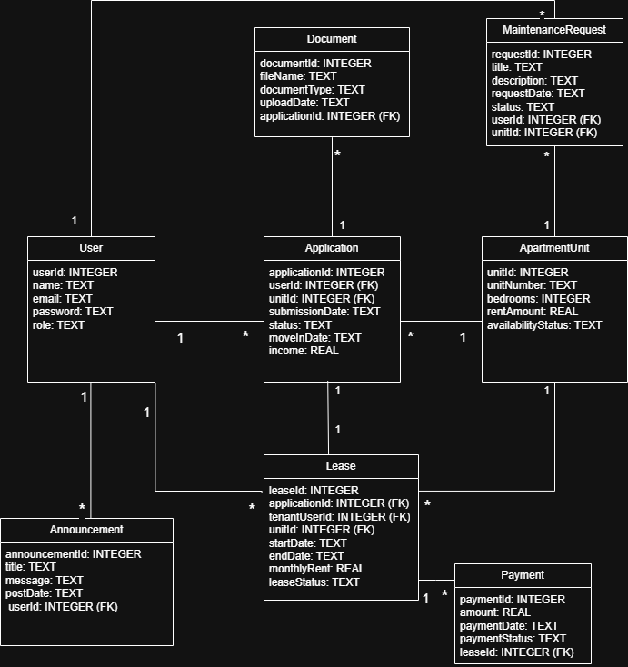

## Database Overview

This document provides an overview of the database component used in the apartment portal system, including structure, usage, and example queries.

This SQLite database supports the apartment portal system by managing users, applications, leases, and payments. The schema is designed to reflect the workflow from application submission through approval, lease creation, and payment tracking. Sample data is included to demonstrate this progression.

Note: The .db file is treated as a generated artifact and should not be edited directly. All schema or data changes should be made through the schema definition.

### Design Notes

The database schema was designed with simplicity and clarity in mind to support consistent integration across the application. Primary and foreign key relationships enforce referential integrity between users, applications, leases, and payments.

The structure allows for straightforward querying while maintaining a logical representation of real-world workflow progression within the system.

### Requirements

Install DB Browser for SQLite:  
https://sqlitebrowser.org/dl/


### How to Open the Database

1. Download the `apartment_portal.db` file from this repository  
2. Open DB Browser for SQLite  
3. Click "Open Database"  
4. Select the downloaded `.db` file


### Viewing Data

Go to the "Browse Data" tab to view the following tables:

- User  
- Application  
- Lease  
- Payment  


### Running Queries (Dashboard View)

1. Navigate to the "Execute SQL" tab  
2. Run the following query:

```sql
SELECT u.name, a.status, l.leaseStatus, p.amount
FROM User u
JOIN Application a ON u.userId = a.userId
JOIN Lease l ON a.applicationId = l.applicationId
JOIN Payment p ON l.leaseId = p.leaseId;
```
This query returns:
- Applicant status (Pending or Approved)
- Lease status
- Payment details


## Database Schema (UML)

The following diagram reflects the implemented database schema and table relationships:


