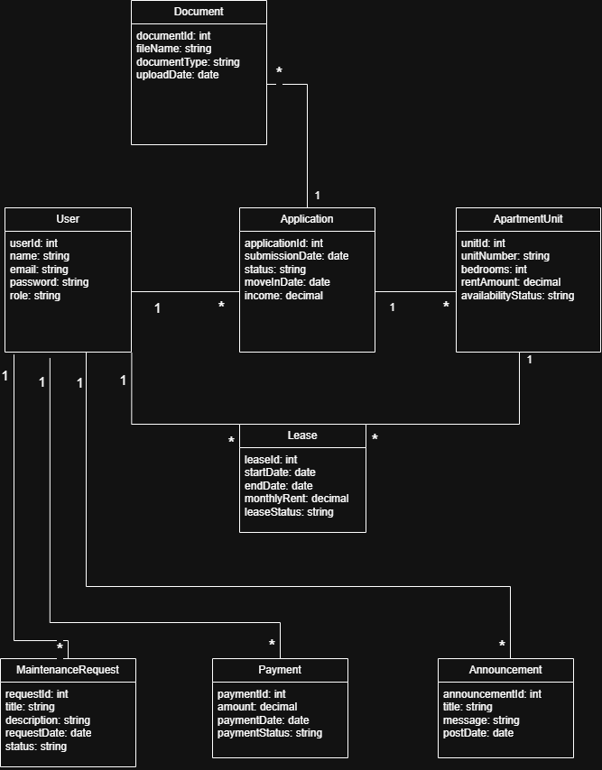

# UML Diagrams

## Overview
This document contains UML diagrams for the apartment portal system. These diagrams focus on the backend and data layer, including entity relationships and system flow.

**Note:** This is a working draft and open to updates based on team input.

## Class Diagram (Data Model)

Description:
- Represents core entities such as Users, Applications, ApartmentUnits, Leases, and Payments
- Shows relationships between system components
  

Status:
- Initial version (still open to edits)
- Transfer to `database/schema.sql` in progress 

## Sequence Diagram 

Description:
- Will illustrate the flow of a key system interaction such as submitting an application or making a payment

Status:
- In progress

## System Architecture Diagram 

Description:
- Will provide a high-level overview of frontend, backend, and database interactions

Status:
- In progress
