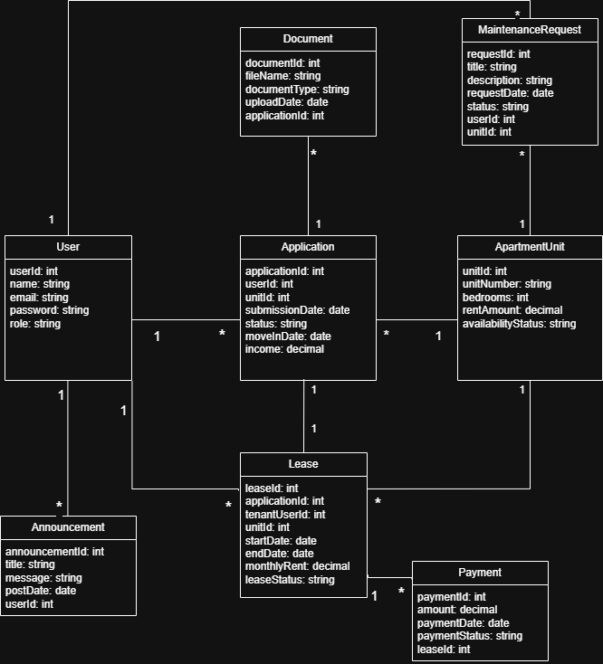

# UML Diagrams

## Overview
This UML diagram represents the core database structure for the apartment portal system. It focuses on the following entities: users, applications, apartment units, leases, documents, maintenance requests, announcements, and payments.

**Note:** This is a working draft and open to updates based on team input **until the end of week 3**

## Class Diagram (Data Model)

